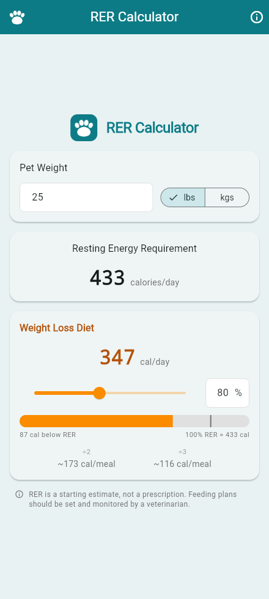

# RER Calculator

[](https://github.com/insomnolence/rer-calculator/actions/workflows/ci.yml)

A small Flutter app that calculates a pet's **Resting Energy Requirement** and
turns it into a daily feeding target, for use at the exam room table.

Enter a weight, pick a restriction percentage, and it shows the daily calorie
target, how that compares to full RER, and what it works out to per meal.

<p align="center">
  
</p>

## What it calculates

Resting Energy Requirement is the energy a resting animal uses in a
thermoneutral environment. The app uses the standard allometric formula, which
holds across species and body sizes:

```
RER (kcal/day) = 70 x (body weight in kg) ^ 0.75
```

The daily target is then a percentage of that:

```
target = RER x (restriction % / 100)
```

Pound input is converted with the clinic convention of **2.2 lb/kg** rather than
the exact 2.20462. The difference is under 0.2% of RER, comfortably inside the
error of the formula itself, and it keeps the numbers matching hand-worked
charts. It is a single constant (`kPoundsPerKilogram`) if you want to change it.

### Restriction zones

The percentage slider runs from 50% to 120%, and the app names the zone you are
in so the number is not the only signal:

| Range     | Zone                   | Typical use                                    |
| --------- | ---------------------- | ---------------------------------------------- |
| 50-69%    | Aggressive Restriction | Rapid loss; close veterinary supervision        |
| 70-85%    | Weight Loss Diet       | Standard weight-reduction plan                  |
| 86-94%    | Mild Restriction       | Gentle loss or holding after a reduction        |
| 95-100%   | Maintenance            | Holding current weight                          |
| 101-120%  | Weight Gain            | Underweight, convalescent or recovering patients |

The comparison bar draws the target against the full 0-120% range, with a tick
marking 100% of RER, so the weight-gain zone is visible rather than clipped.

> RER is a starting estimate, not a prescription. Real maintenance energy
> requirements vary with age, neuter status, activity and body condition, and a
> feeding plan should always be set and monitored by a veterinarian.

## Getting started

Requires the [Flutter SDK](https://docs.flutter.dev/get-started/install)
(Dart SDK 3.10+).

```bash
flutter pub get
flutter run
```

Built and tested on **Android** and **Linux desktop**. The iOS, macOS and
Windows targets are configured and should build, but are unverified.

```bash
flutter test      # unit and widget tests
flutter analyze   # static analysis
```

## Branding

The app ships with a neutral identity: a teal palette and a paw mark drawn in
code (`lib/widgets/app_logo.dart`), with no bundled logo files.

If you want to run it under your own practice's branding, drop a `brand.json`
and your logo images into `assets/brand/`. That folder is **gitignored**, so
your branding stays local and cannot be pushed by accident — a fresh clone
always falls back to the generic identity.

```json
{
  "appTitle": "RER Calculator",
  "primary": "#00A3E0",
  "secondary": "#8DC63F",
  "background": "#BAE9FC",
  "wordmark": "assets/brand/wordmark.png",
  "icon": "assets/brand/icon.png"
}
```

Any key you omit falls back to the generic value, and a malformed file falls
back entirely rather than stopping the app. See
[`assets/brand/README.md`](assets/brand/README.md) for the full reference.

Launcher icons are generated from `assets/icon/app_icon.svg`:

```bash
./tool/generate_icons.sh
```

## Project layout

| Path                            | What lives there                                 |
| ------------------------------- | ------------------------------------------------ |
| `lib/rer_calculator.dart`       | The calculation model. Pure Dart, no Flutter UI   |
| `lib/branding.dart`             | Brand pack loading and the generic identity       |
| `lib/theme.dart`                | Theme construction and restriction zone colours   |
| `lib/widgets/`                  | Screen and its parts                              |
| `test/`                         | Unit tests for the model, widget tests for the UI |

The calculation model is deliberately free of Flutter UI imports, so the maths
is tested directly rather than through widgets.

## License

[MIT](LICENSE).
